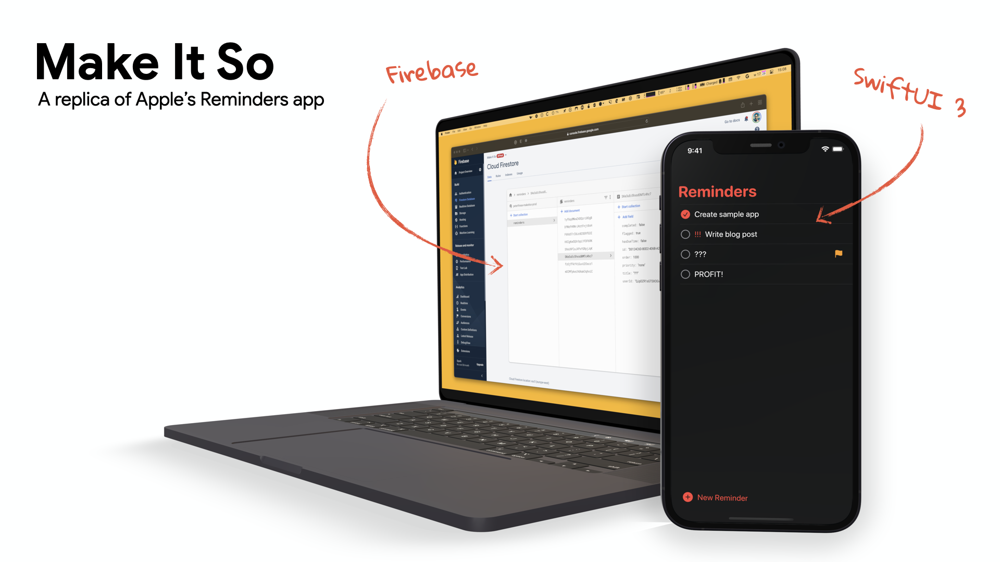

<!-- PROJECT SHIELDS -->
[![Xcode][xcode-shield]][xcode-url]
[![Swift][swift-shield]][swift-url]
[![Contributors][contributors-shield]][contributors-url]
[![Forks][forks-shield]][forks-url]
[![Stargazers][stars-shield]][stars-url]
[![Issues][issues-shield]][issues-url]
[![MIT License][license-shield]][license-url]

<!-- PROJECT LOGO -->
 

  

  <h1 align="center">Make It So - Again!</h1>

  

    This is the source code for <i>Make It So</i>, a sample app that demonstrates how to use Firebase in a SwiftUI app that runs on all (most) of Apple's platforms.
     
    <a href="https://twitter.com/peterfriese/status/1453467058302291975"><strong>Follow along on Twitter as I code the app »</strong></a>
     
     
    <a href="https://github.com/peterfriese/MakeItSo/issues">Report Bug</a>
    ·
    <a href="https://github.com/peterfriese/MakeItSo/issues">Request Feature</a>
  

# Getting started

This app requires a Firebase project, which you can create at no cost using the [Firebase Console](https://console.firebase.google.com). Here are the steps. For a more detailed description of how to add Firebase to an iOS project, refer to the [official Firebase docs for iOS and Apple's other platforms](https://firebase.google.com/docs/ios/setup).

1. Clone the repo
1. Create a Firebase project
2. Create a Cloud Firestore database in the new Firebase project ([link](https://console.firebase.google.com/project/_/firestore/))
2. Enable Anonymous Authentication ([link](https://console.firebase.google.com/project/_/authentication/providers))
1. Register the iOS app in the Firebase project
1. Download the `GoogleService-Info.plist` file to the `code/frontend/Configuration/Firebase/Development` folder
1. Open `MakeItSo.xcodeproj` in Xcode
1. Select the `MakeItSo (iOS) DEV` target
1. Run the app

# About the project

<!-- LICENSE -->
## License

See [LICENSE](LICENSE)

<!-- Disclaimer -->
## Disclaimer

This is not an official Google product.

<!-- CONTACT -->
## Contact
Peter Friese - [@peterfriese](https://twitter.com/peterfriese)

Project Link: [https://github.com/peterfriese/MakeItSo](https://github.com/peterfriese/MakeItSo)

<!-- ACKNOWLEDGEMENTS -->

## Acknowledgements

The application icon is based on [Check](https://thenounproject.com/term/check/1905028/) by [Robert Won](https://thenounproject.com/robertwon/) from the [Noun Project](https://thenounproject.com/)

<!-- MARKDOWN LINKS & IMAGES -->
<!-- https://www.markdownguide.org/basic-syntax/#reference-style-links -->
[xcode-shield]: https://img.shields.io/badge/xcode-v13.3.1-blue
[xcode-url]: https://developer.apple.com/xcode/

[swift-shield]: https://img.shields.io/badge/swift-v5.5-%23fe4b2d
[swift-url]: https://swift.org/

[contributors-shield]: https://img.shields.io/github/contributors/peterfriese/MakeItSo.svg?style=flat-square
[contributors-url]: https://github.com/peterfriese/MakeItSo/graphs/contributors

[forks-shield]: https://img.shields.io/github/forks/peterfriese/MakeItSo.svg?style=flat-square
[forks-url]: https://github.com/peterfriese/MakeItSo/network/members

[stars-shield]: https://img.shields.io/github/stars/peterfriese/MakeItSo.svg?style=flat-square
[stars-url]: https://github.com/peterfriese/MakeItSo/stargazers

[issues-shield]: https://img.shields.io/github/issues/peterfriese/MakeItSo.svg?style=flat-square
[issues-url]: https://github.com/peterfriese/MakeItSo/issues

[license-shield]: https://img.shields.io/github/license/peterfriese/MakeItSo.svg?style=flat-square
[license-url]: https://github.com/peterfriese/MakeItSo/blob/master/LICENSE

[linkedin-shield]: https://img.shields.io/badge/-LinkedIn-black.svg?style=flat-square&logo=linkedin&colorB=555
[linkedin-url]: https://linkedin.com/in/peterfriese
[product-screenshot]: assets/screenshot.png
[product-demo]: assets/demo.gif
[product-screenshot]: assets/screenshot.png "Screenshot of Make It So, a replication of the iOS Reminders app"
